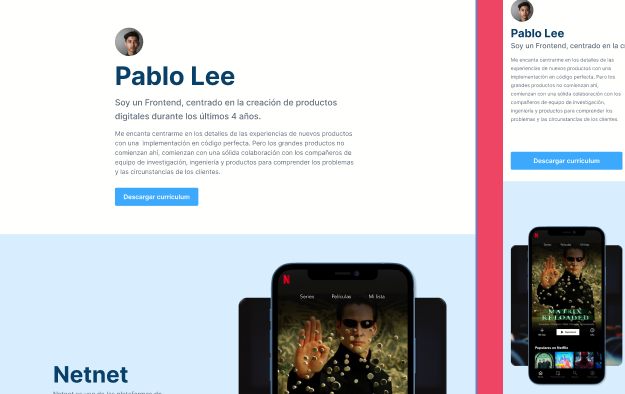

# figma layout projects

Repository where different figma portfolios are laid out to practice HTML, CSS and Javascript.

# Project 1

- portafolio-pablo
	- In this project a portfolio is made from the guide of a figma layout. It is made with HTML, CSS and a bit of JavaScript.
	- Made from the [https://leonidasesteban.com/](https://leonidasesteban.com/proyectos/portafolio-pablo) site of the projects section

	- You can see it displayed at the following URL [Portafolio_de_Pablo_Link](https://klich1984.github.io/maquetacion-portafolio)

